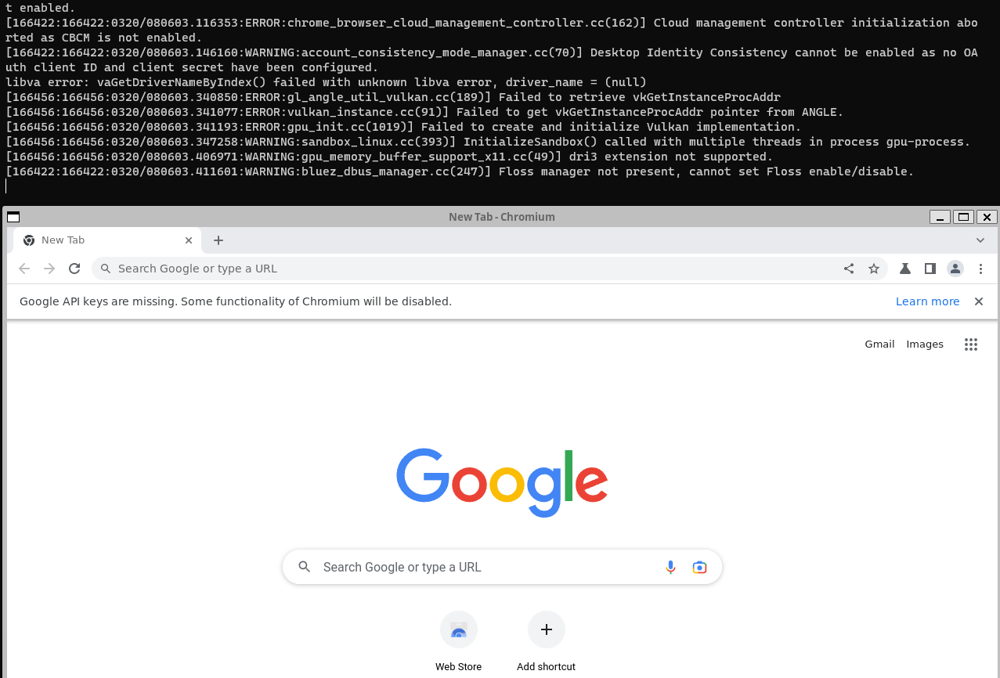

# Design a Service which alerts about Malicious site on a browser

## 1. Functional Requirements

* Whenever user tries to open a link via redirect or by entering URL in the browser, website has to be evaluated.
* If Malicious website is detected, should show a pop-up, else open the website
* A way to receive reports from users about malicious websites
* keep updated malicious website database

## 2. Non-Functional Requirements

* <mark style="color:red;">Highly Available</mark> - Website should be up most of the time.&#x20;
* <mark style="color:red;">Consistency</mark> - Eventual Consistent state of database
* <mark style="color:red;">Secure -</mark>  Our service should be secure that no one can just mark any website as malicious
* <mark style="color:red;">Scalability</mark> -  Should withstand peak loads
* <mark style="color:red;">Performance</mark>  - Should be able to classify websites as malicious with minimal latency

## 3. Back of the envelope estimations

* Daily Active users - 1 Billion
* Average number of sites a user visits in a day = 20
* Network Estimation:
  * 10^9 \* 20 /10^5 = 2 \* 10^5 \* 1000 Bytes(Assuming avg URL length is 1000)
  * \= 0.2GBPS = 1.6Gbps incoming

Back of the envelope estimations really don't seem to be useful for this specific system. Reason being, we could just store malicious website data on the client side and just keep updating this asynchronously.

## 4. High Level Design

<figure><figcaption>
Initial Design
</figcaption></figure>
